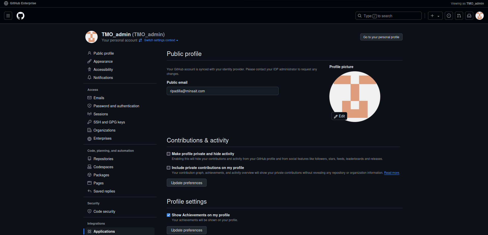
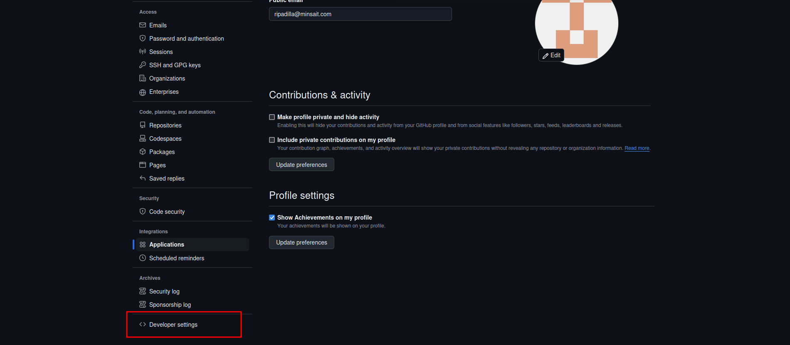
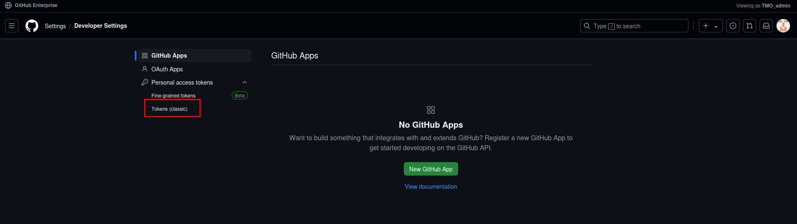
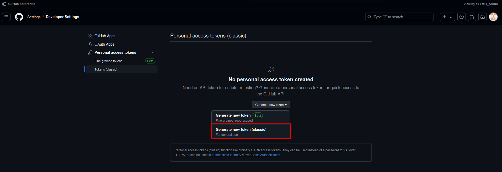
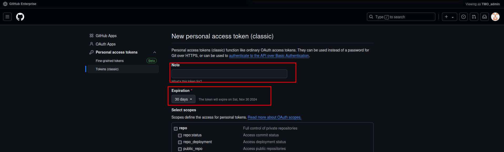
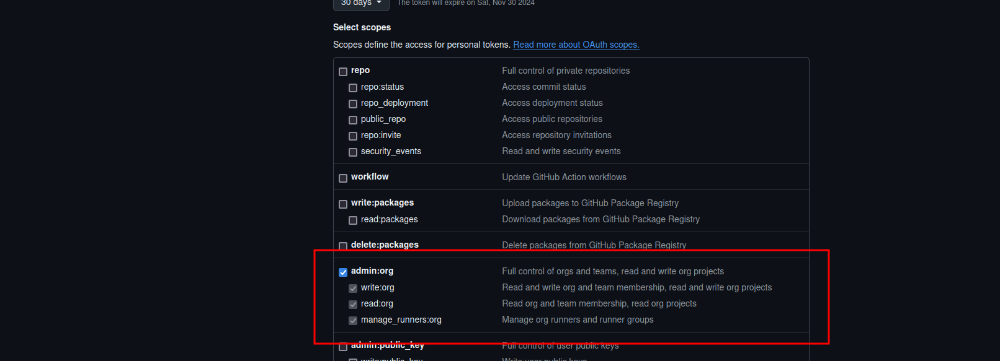
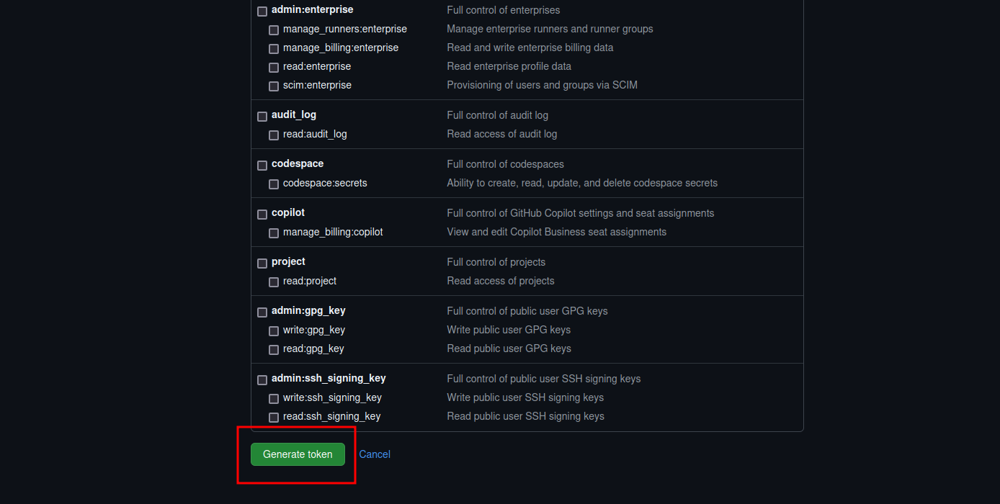
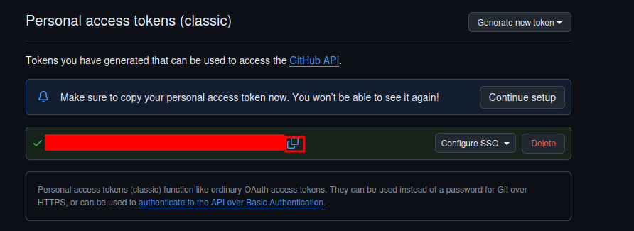

# GitHub Rulesets - Pull Request Rules

## Descripción
El repositorio contiene las siguientes reglas a nivel organización:
1. Las ramas __task/*__ y __feature/*__ podrán pasar automáticamente el pull request, sin ser aprovadas por un revisor.
2. Las ramas __dev__ y __test__ deberán ser aprovadas por al menos un revisor y esta figura será el lider técnico, el cual debe estar en el grupo asignado.
3. La rama __master__ deberá ser aprovada por al menos un revisor y esta figura será un equipo especial, el cual debe estar en el grupo asignado.

## Requisitos
1. Generar un token de acceso personal en GitHub con los permisos necesarios para crear reglas de pull request.

## Crear token de acceso personal
1. Ingresar con el usuario de administrador a GitHub.
2. Ir al apartado de **settings** del usuario administrador: 
3. Ir al apartado de **Developer settings**: 
4. Ir al apartado de **Personal access tokens**: 
5. Crear un nuevo token de acceso personal con los permisos necesarios: 
6. Darle un nombre al token y duración de expiración: 
7. Seleccionar los permisos necesarios para el token: 
8. Generar el token: 
9. Copiar el token generado y guardarlo en un lugar seguro: 

## Crear reglas y equipos
1. Crear un entorno virtual para descargar las dependencias necesarias usando el comando:
   ```shell
     python3 -m venv venv
    ```
2. Activar el entorno virtual usando el comando:
   ```shell
   source venv/bin/activate
    ```
3. Instalar las dependencias necesarias usando el comando:
   ```shell
   pip install -r requirements.txt
    ```
4. Crear un archivo ***.env*** en la raíz del proyecto con las siguientes variables:
   1. **ORGANIZATION_NAME**: Nombre de la organización en GitHub.
   2. **GITHUB_TOKEN**: Token de acceso personal en GitHub.
5. Ejecutar el script usando el comando 
   ```shell
   python3 ./src/app/main.py
    ```

## Eliminar reglas y equipos
Permitirá eliminar todas las reglas y equipos creados en la organización de GitHub.
1. Ejecutar el script usando el comando:
   ```shell
   python3 ./src/app/main.py --delete
    ```
